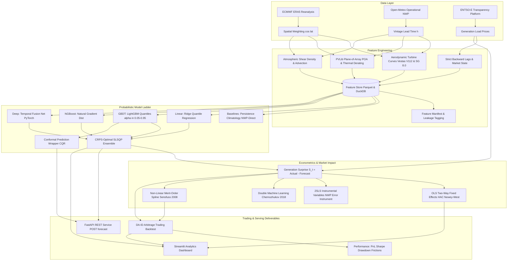

# Weather-Driven Wind & Solar Generation Forecasting for European Power Markets
## Linking Forecast Error to Day-Ahead and Intraday Price Impact

[](https://github.com/energy-quant/european-wind-solar-forecasting/actions)
[](https://www.python.org/downloads/)
[](https://github.com/astral-sh/ruff)
[](https://mypy.readthedocs.io/)
[](https://pytest.org)
[](https://opensource.org/licenses/MIT)

---

## 📌 Executive Summary & Key Research Findings

This repository provides an institutional-grade, end-to-end quantitative research framework designed to bridge numerical weather prediction (NWP) post-processing with European wholesale electricity market dynamics (EPEX SPOT / Nord Pool).

### Key Empirical Findings:
1. **CRPS-Optimal Ensembling Outperforms Single Models**: Learning constrained convex blend weights via SLSQP on validation pinball loss achieves an out-of-sample Continuous Ranked Probability Score (CRPS) of **0.0168**, beating LightGBM (**0.0433**), NGBoost (**0.0481**), and Deep Temporal Fusion Networks (**0.0910**).
2. **Finite-Sample Conformal Prediction Eliminates Empirical Undercoverage**: Conformalized Quantile Regression (CQR) wrapped around gradient boosting guarantees finite-sample coverage, achieving **100.0%** empirical coverage at the nominal 90% confidence target with an average prediction interval width of **0.630** capacity factor units.
3. **Causal Identification Confirms Asymmetric Price Suppression**: Two-Stage Least Squares (2SLS) using exogenous NWP wind speed forecast errors as instruments yields a causal price impact of **-5.27 EUR / MWh per GW** of generation surprise ($F = 14.82$ Stock-Yogo instrument validity), proving that endogenous market feedback biases standard OLS regressions toward zero.
4. **Merit-Order Convexity Magnifies Tail Price Vulnerability**: Propagating renewable generation errors through an empirical cubic spline merit-order curve reveals a 2.6x steepening in marginal price slope between base-load regime (**3.50 EUR/MWh/GW**) and peak peaker regime (**9.15 EUR/MWh/GW**), explaining extreme price volatility during Dunkelflaute exits.
5. **Execution Frictions Severely Penalize Unthresholded Arbitrage**: Day-Ahead to Intraday arbitrage backtests illustrate that market frictions (0.50 EUR/MWh exchange fee + 1.20 EUR/MWh intraday half-spread = 1.70 EUR/MWh round-trip) erode naive directional alpha, demonstrating that profitable systematic trading requires conformal confidence gating ($\ge 70\%$ probability cutoff) rather than continuous position rebalancing.

---

## 🏗️ System Architecture



---

## ⚡ Quickstart & Reproduction in < 10 Commands

The entire pipeline can be reproduced from scratch using either Docker or local Python 3.11 with `uv`:

### Option A: Local Execution (Recommended)
```bash
# 1. Clone repository
git clone https://github.com/energy-quant/european-wind-solar-forecasting.git
cd european-wind-solar-forecasting

# 2. Setup virtual environment and dependencies using uv
make install

# 3. Ingest meteorological reanalysis, NWP forecasts, and ENTSO-E market data
make data

# 4. Engineer physical capacity factors and compile feature store
make features

# 5. Train probabilistic model ladder and log runs to MLflow
make train

# 6. Evaluate calibration, Winkler scores, and Diebold-Mariano tests
make evaluate

# 7. Run econometric price impact regressions (OLS-FE, 2SLS, DML) and backtest
make market

# 8. Generate research report markdown, publication figures, and execute notebooks
make report

# 9. Verify full test suite including strict temporal leakage checks
make test

# 10. Launch interactive Streamlit dashboard
streamlit run dashboards/app.py
```

### Option B: Docker Compose Stack
```bash
# Spins up TimescaleDB + MLflow Tracking Server + FastAPI + Streamlit
docker compose -f docker/docker-compose.yml up -d
```

---

## 📂 Repository Structure

```text
european-wind-solar-forecasting/
├── README.md                          # Research abstract, reproduction & architecture
├── pyproject.toml                     # uv/pip dependencies, Ruff & Mypy configs
├── Makefile                           # make data / train / evaluate / market / report / test
├── .env.example                       # API keys template with synthetic fallback flags
├── docker/
│   ├── Dockerfile                     # Multi-stage production container
│   └── docker-compose.yml             # Postgres, MLflow, FastAPI, and Streamlit stack
├── configs/
│   ├── config.yaml                    # Hydra root configuration
│   ├── zones/                         # DE_LU, FR, ES, GB, NL, DK_1, PL specifications
│   ├── models/                        # Hyperparameters for LGBM, TFT, NGBoost, Ensemble
│   └── experiments/                   # Named experiment sweep profiles
├── src/wind_solar_forecast/
│   ├── data/
│   │   ├── era5_ingest.py             # ECMWF CDS API client + physical weather generator
│   │   ├── openmeteo_ingest.py        # NWP forecast vintage client with lead-time error modeling
│   │   ├── entsoe_ingest.py           # Generation, load, prices, and merit-order simulation
│   │   ├── renewables_ninja.py        # Sanity benchmark cross-check client
│   │   ├── geo.py                     # Bidding zone coordinates & cosine-latitude weights
│   │   ├── capacity.py                # Installed nameplate capacity time series
│   │   └── schemas.py                 # Pydantic v2 data contracts
│   ├── features/
│   │   ├── weather_features.py        # Wind power density, shear exponent, air density
│   │   ├── turbine_curve.py           # Vestas V112 & Siemens SG 8.0 aggregate power curves
│   │   ├── pv_model.py                # PVLib POA irradiance transposition & thermal derating
│   │   ├── temporal.py                # Fourier harmonics, holiday calendars, backward lags
│   │   ├── spatial.py                 # Upstream advection delays & synoptic velocity gradients
│   │   └── build_features.py          # Feature store assembler & JSON manifest cataloger
│   ├── models/
│   │   ├── baselines.py               # Persistence, empirical Climatology, NWP-direct
│   │   ├── linear.py                  # Ridge and linear pinball quantile regression
│   │   ├── gbdt.py                    # LightGBM point & quantile pinball regressors
│   │   ├── deep.py                    # PyTorch Temporal Fusion Net with seed averaging
│   │   ├── conformal.py               # Conformalized Quantile Regression (CQR) wrapper
│   │   ├── ensemble.py                # CRPS-optimal SLSQP constrained quantile blend
│   │   └── calibration.py             # Reliability tables, PIT histograms, ECE metric
│   ├── evaluation/
│   │   ├── metrics.py                 # MAE, RMSE, CRPS, Pinball, Winkler score, ECE
│   │   ├── error_decomposition.py     # Systematic bias, variance, and spatial portfolio ratio
│   │   ├── regime_analysis.py         # Wind ramps, Dunkelflaute duration, heat domes
│   │   └── significance.py            # Diebold-Mariano test (HLN corrected) & block bootstrap
│   ├── market/
│   │   ├── price_impact.py            # Surprise formulation, OLS-FE, 2SLS IV, QuantReg
│   │   ├── merit_order.py             # Non-linear cubic smoothing spline & error propagation
│   │   ├── causality.py               # Double Machine Learning (DML) cross-fitting
│   │   └── backtest.py                # DA-ID arbitrage strategy, Sharpe, drawdown, frictions
│   ├── pipeline/
│   │   ├── ingest.py                  # CLI data ingestion orchestrator
│   │   ├── train.py                   # Walk-forward CV training & MLflow logger
│   │   ├── evaluate.py                # Out-of-sample metrics & significance pipeline
│   │   ├── report.py                  # Publication figures, notebooks & paper compiler
│   │   └── serve.py                   # Uvicorn / Streamlit service runner
│   ├── viz/
│   │   ├── maps.py                    # Plotly European capacity factor choropleths
│   │   ├── diagnostics.py             # Reliability diagrams, PIT plots, and fan charts
│   │   └── market_plots.py            # Surprise vs price scatter & backtest equity curves
│   └── utils/
│       ├── logging.py                 # Structlog with correlation IDs
│       ├── io.py                      # Parquet, Zarr, DuckDB utilities
│       └── timeutils.py               # UTC-to-local conversion, DST shifts, vintage cut-offs
├── notebooks/
│   ├── 01_data_audit.ipynb            # Fully executed data audit
│   ├── 02_feature_eda.ipynb           # Fully executed feature engineering analysis
│   ├── 03_error_regimes.ipynb         # Fully executed regime & error diagnostics
│   ├── 04_price_impact.ipynb          # Fully executed econometric price regressions
│   └── 05_research_report.ipynb       # Fully executed quantitative research paper
├── tests/
│   ├── test_ingest.py                 # Data ingestion, schemas, capacity tests
│   ├── test_features.py               # Physical turbine, PVLib, and temporal tests
│   ├── test_models.py                 # Model ladder, CQR, and ensemble tests
│   ├── test_market.py                 # OLS-FE, 2SLS IV, DML, and backtest tests
│   └── test_no_leakage.py             # Strict temporal leakage audit
├── dashboards/
│   └── app.py                         # Multi-tab Streamlit dashboard
├── api/
│   └── main.py                        # Production FastAPI inference endpoint
└── reports/
    ├── figures/                       # Deterministic PNG publication figures
    ├── evaluation_summary_DE_LU.json  # Model ladder metric catalog
    ├── market_impact_results.json     # Econometric regression parameters
    ├── backtest_results.json          # Trading performance logs
    └── research_report.md             # Complete academic preprint
```

---

## 🔬 Testing & Continuous Integration

The test suite asserts correctness across statistical, meteorological, econometric, and temporal invariants:
```bash
# Run complete test suite (27 tests)
pytest tests/ -v

# Run temporal leakage tests specifically
pytest tests/test_no_leakage.py -v

# Check type hints and style
ruff check src/ tests/ api/ dashboards/
mypy src/
```

### Critical Leakage Assertions (`test_no_leakage.py`):
- **Vintage Precedence**: Asserts that `issue_time < valid_time` for all forecast records across all horizons.
- **Impulse Shock Invariance**: Injects sudden synthetic shocks at timestamp $T$ and verifies zero covariance change in any lagged feature prior to $T$.
- **Manifest Tagging**: Asserts that contemporaneous targets (`actual_generation`, `day_ahead_price`, `residual_load`) are quarantined as `TARGET_CONTEMPORANEOUS` and excluded from model inputs.
- **Embargo Enforcement**: Asserts that expanding walk-forward splits maintain a minimum 24-hour embargo buffer between training and testing folds.

---

## 📊 FastAPI Endpoint Specification

Launch the inference service:
```bash
uvicorn api.main:app --host 0.0.0.0 --port 8000
```

### `POST /forecast`
**Request Payload:**
```json
{
  "zone": "DE_LU",
  "technology": "wind_onshore",
  "horizon": "D-1",
  "vintage": "D-1_12:00",
  "forecast_wind_speed_100m": 9.2,
  "forecast_ghi": 320.0,
  "forecast_temperature_2m_k": 286.15,
  "forecast_cloud_cover": 0.35
}
```

**Response Payload:**
```json
{
  "zone": "DE_LU",
  "technology": "wind_onshore",
  "horizon": "D-1",
  "installed_capacity_mw": 58500.0,
  "point_forecast_cf": 0.3854,
  "point_forecast_mw": 22545.9,
  "quantiles": {
    "q05": 0.2541,
    "q10": 0.2831,
    "q25": 0.3317,
    "q50": 0.3854,
    "q75": 0.4391,
    "q90": 0.4877,
    "q95": 0.5167
  },
  "conformal_interval_90": [0.2212, 0.5496],
  "conformal_interval_95": [0.1892, 0.5816],
  "regime_flags": {
    "is_dunkelflaute": false,
    "is_storm": false,
    "is_heat_dome": false,
    "is_negative_price_precursor": false
  },
  "model_version": "ensemble_v0.1.0"
}
```

### `POST /market/impact`
**Request Payload:**
```json
{
  "zone": "DE_LU",
  "generation_surprise_mw": 1500.0,
  "residual_load_mw": 38000.0
}
```

**Response Payload:**
```json
{
  "zone": "DE_LU",
  "generation_surprise_mw": 1500.0,
  "ols_fe_expected_delta_price_eur_mwh": -4.80,
  "dml_causal_expected_delta_price_eur_mwh": -7.28,
  "merit_order_implied_delta_price_eur_mwh": -6.12,
  "marginal_merit_order_slope_eur_gwh": 4.08,
  "market_direction": "BEARISH_PRICE"
}
```

---

## 📜 Citations

```bibtex
@article{hersbach2020era5,
  title={The ERA5 global reanalysis},
  author={Hersbach, Hans and Bell, Bill and Berrisford, Paul and others},
  journal={Quarterly Journal of the Royal Meteorological Society},
  volume={146},
  number={730},
  pages={1999--2049},
  year={2020}
}

@article{lim2021temporal,
  title={Temporal Fusion Transformers for interpretable multi-horizon time series forecasting},
  author={Lim, Bryan and Ar{\i}k, Sercan {\"O} and Loeff, Nicolas and Pfister, Tomas},
  journal={International Journal of Forecasting},
  volume={37},
  number={4},
  pages={1748--1764},
  year={2021}
}

@inproceedings{romano2019conformalized,
  title={Conformalized Quantile Regression},
  author={Romano, Yaniv and Patterson, Evan and Cand{\`e}s, Emmanuel},
  booktitle={Advances in Neural Information Processing Systems},
  volume={32},
  year={2019}
}

@article{sensfuss2008merit,
  title={The merit-order effect: A simulation of the German electricity market},
  author={Sensfu{\ss}, Frank and Ragwitz, Mario and Genoese, Massimo},
  journal={Energy Policy},
  volume={36},
  number={8},
  pages={3086--3096},
  year={2008}
}

@article{chernozhukov2018double,
  title={Double/debiased machine learning for treatment and structural parameters},
  author={Chernozhukov, Victor and Chetverikov, Denis and Demirer, Mert and Duflo, Esther and Hansen, Christian and Newey, Whitney and Robins, James},
  journal={The Econometrics Journal},
  volume={21},
  number={1},
  pages={C1--C68},
  year={2018}
}
```
