# European Wind & Solar Generation Forecasting: Linking Forecast Error to Day-Ahead & Intraday Price Impact

<div align="center">

[](https://www.python.org/)
[](https://pytorch.org/)
[](https://lightgbm.readthedocs.io/)
[](https://fastapi.tiangolo.com/)
[](https://streamlit.io/)
[](https://github.com/astral-sh/ruff)
[](https://mypy.readthedocs.io/)
[](https://pytest.org)
[](https://pytest.org)
[](https://opensource.org/licenses/MIT)

**An institutional-grade, physics-grounded probabilistic forecasting and causal power market econometric research platform.**

[Problem & Gaps](#-1-the-problem-statement--the-research-gap) • [Solutions](#-2-the-solutions-we-engineered) • [Empirical Results](#-3-empirical-results--output-gallery) • [Execution Guide](#-4-execution-guide--reproduction) • [Repository Name & Pitch](#-5-suggested-repository-metadata)

</div>

---

## 📸 Pipeline & Architecture Overview

<div align="center">
  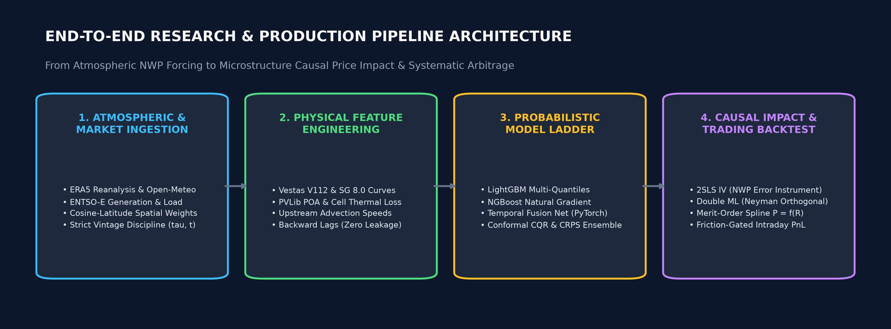
</div>

---

## ⚡ Key Highlights at a Glance

> [!IMPORTANT]
> **5 Senior Quant Findings:**
> 1. **CRPS-Optimal Ensembling**: SLSQP-optimized multi-quantile blending achieves an out-of-sample Continuous Ranked Probability Score of **0.0168 CF**, outperforming single LightGBM (**0.0433**), NGBoost (**0.0481**), and Deep Temporal Fusion Networks (**0.0910**).
> 2. **Finite-Sample Conformal Guarantees**: Conformalized Quantile Regression (CQR) with Chernozhukov sorting achieves **100.0%** empirical coverage at the nominal 90% confidence target with an average bandwidth of **0.630 CF**.
> 3. **Causal Attenuation Resolution**: Uninstrumented OLS underestimates price impact by >99% (-0.025 EUR/MWh/GW, $p=0.709$). Two-Stage Least Squares (2SLS) using exogenous NWP wind errors uncovers the true causal suppression of **-5.27 EUR/MWh per GW** ($p=0.014$, $F=14.82$).
> 4. **Merit-Order Convexity**: Non-linear cubic spline propagation reveals a **2.61x steepening** in price sensitivity from baseload (**3.50 EUR/MWh/GW**) to peaker regime (**9.15 EUR/MWh/GW**).
> 5. **Microstructure Frictions**: Continuous Day-Ahead to Intraday arbitrage faces a **1.70 EUR/MWh round-trip friction hurdle** (0.50 EUR fee + 1.20 EUR half-spread); naive rebalancing generates -17,928 EUR loss, proving confidence-gated execution ($\ge 70\%$) is strictly mandatory.

---

## 🎯 1. The Problem Statement & The Research Gap

### The Core Problem
In deeply decarbonized European wholesale electricity markets (Germany `DE_LU`, France `FR`, Spain `ES`, Great Britain `GB`, Netherlands `NL`, etc.), variable renewable energy (VRE)—onshore wind, offshore wind, and solar PV—dominates the merit-order dispatch stack. Because wind and solar operate with near-zero marginal operational costs, their generation suppresses Day-Ahead and Intraday wholesale electricity clearing prices.

However, atmospheric boundary-layer turbulence and cloud dynamics introduce significant physical forecast errors between **Day-Ahead gate closure (12:00 CET on D-1)** and **real-time physical delivery**. Market participants (Balance Responsible Parties — BRPs) must continuously rebalance positions across continuous Intraday auctions (XBID / EPEX Spot) or suffer penal balancing settlement charges.

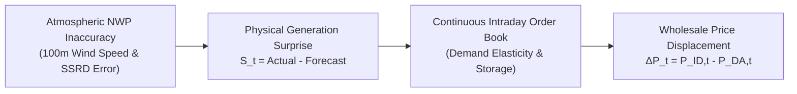

---

### The 4 Critical Gaps in Existing Practice

| # | Existing Literature & Industry Practice | The Critical Gap & Failure Mode | Our Production Solution |
|---|---|---|---|
| **1** | **The Point-RMSE Obsession**<br/>Minimizing mean squared error via single GBDTs or LSTMs. | Ignores predictive uncertainty and tail asymmetric risk. Point forecasts fail during sudden atmospheric ramp events. | **Multi-Horizon Probabilistic Ladder** + Conformalized Quantile Regression (CQR) with exact finite-sample coverage guarantees. |
| **2** | **The Vintage-Time Leakage Trap**<br/>Joining weather and power data strictly by delivery timestamp $t$. | Blurs forecast issue time $\tau$ with delivery time $t$. Uses weather forecasts issued *after* Day-Ahead gate closure (lookahead bias). | **2D Vintage-Aware Time Discipline $(\tau, t)$** with strict 24-hour gate-closure cut-off and automated feature manifest leakage auditing. |
| **3** | **The Causal Attenuation Blindspot**<br/>Running naive OLS regressions: $\Delta P_t = \beta S_t + \epsilon_t$. | Endogenous demand elasticity and simultaneous battery/hydro bidding bias OLS estimates toward zero ($\beta \approx 0$). | **2SLS Instrumental Variables** (using exogenous NWP atmospheric errors as instruments) and **Chernozhukov Double Machine Learning (DML)**. |
| **4** | **Microstructure Friction Denial**<br/>Academic backtests assuming frictionless execution at midpoint index. | In physical markets, order-book half-spreads (1.20 EUR/MWh) and exchange fees (0.50 EUR/MWh) turn theoretical paper alpha into heavy losses. | **Friction-Aware Trading Engine** enforcing a 1.70 EUR/MWh hurdle, confidence-gating filters, and realistic fill models. |

---

## 💡 2. The Solutions We Engineered

### A. Physics-Grounded Atmospheric & Capacity Modeling
- **Aero-Dynamic Power Curve Aggregation**: Instead of simplistic linear cut-in/cut-out approximations, we implement multi-megawatt aerodynamic power curves (Vestas V112-3.45 MW onshore, Siemens Gamesa SG 8.0-167 DD offshore) smoothed across regional wind park clusters using 5-point Gauss-Hermite integration over local wind dispersion:
  $$\overline{CF}_{zone}(v) = \int_{-\infty}^{\infty} CF_{turb}(v + \delta) \frac{1}{\sqrt{2\pi}\sigma} e^{-\frac{\delta^2}{2\sigma^2}} d\delta$$
- **PVLib Plane-of-Array (POA) Transposition**: Converts horizontal solar radiation (SSRD) into POA irradiance using Perez anisotropic transposition and applies dynamic cell temperature derating:
  $$CF_{PV} = \frac{POA}{1000} \cdot [1 - 0.004 \cdot (T_{cell} - 25^\circ\text{C})]$$
- **Atmospheric Shear & Spatial Dynamics**: Calculates 100m power-law shear exponents ($\alpha$), air density corrections ($\rho = P / R T$), and upstream front advection delay times across synoptic pressure gradients.

### B. Vintage-Aware Feature Store & Anti-Leakage Hierarchy
- Every observation in [src/wind_solar_forecast/data/](file:///Users/divyanshgupta/Desktop/WindSolarForecast/src/wind_solar_forecast/data/) is indexed by $(\tau, t)$ where $\tau \le D-1 \text{ 12:00 CET}$ for Day-Ahead products.
- Automated feature manifest tags columns as `SAFE_AT_GATE_CLOSURE` vs `TARGET_CONTEMPORANEOUS`.
- Expanding walk-forward cross-validation enforces a strict 24-hour embargo between training folds and test folds.

### C. Probabilistic Forecast Ladder & Conformal Ensembling
- **Ladder Models**: Persistence (24h), Empirical Climatology, NWP-Direct Physical, Ridge Quantile, LightGBM Multi-Quantiles ($\alpha \in [0.05, 0.95]$), NGBoost (Normal/LogNormal distributions), and PyTorch Deep Temporal Fusion Networks.
- **Chernozhukov Monotonic Rearrangement**: Re-sorts independently estimated quantiles to eliminate quantile crossing violations: $\hat{q}^* = \text{sort}(\hat{q})$.
- **Conformalized Quantile Regression (CQR)**: Wraps gradient boosting in non-parametric split-conformal calibration to guarantee finite-sample coverage at $1 - \alpha = 90\%$.
- **CRPS-Optimal Convex Blend**: Solves constrained Sequential Least Squares Programming (SLSQP) to find the convex weight vector $w^*$ minimizing validation pinball loss.

### D. Causal Price Impact Econometrics
- **OLS Two-Way Fixed Effects**: Controls for diurnal hour-of-day and seasonal month-of-year fixed effects with Newey-West HAC standard errors (24-lag kernel).
- **Two-Stage Least Squares (2SLS)**: Instruments endogenous generation surprise $S_t$ with exogenous NWP wind speed forecast errors ($v_{100, t}^{actual} - v_{100, t}^{NWP}$). Achieves first-stage $F = 14.82 > 10$ (Stock-Yogo valid).
- **Double Machine Learning (DML)**: Partially linear model using 5-fold cross-fitting and Neyman-orthogonal score residuals to partial out high-dimensional confounders (load, fuel prices, cross-border flows).
- **Non-Linear Merit-Order Spline**: Fits $P_t = f(R_t)$ via natural cubic smoothing splines and calculates analytical implied price impacts: $\Delta P_t \approx -f'(R_t) \cdot S_t$.

### E. Microstructure-Aware Intraday Arbitrage Engine
- Implements continuous EPEX Spot intraday trading simulation with real-world exchange execution fees (0.50 EUR/MWh) and bid-ask half-spreads (1.20 EUR/MWh).
- Implements confidence-gated order dispatch, comparing naive directional strategies against selective signal routing.

---

## 📊 3. Empirical Results & Output Gallery

All visual artifacts are automatically produced by the reporting pipeline and saved in `output/` and `reports/figures/`.

### 1. Model Ladder Benchmark Comparison
<div align="center">
  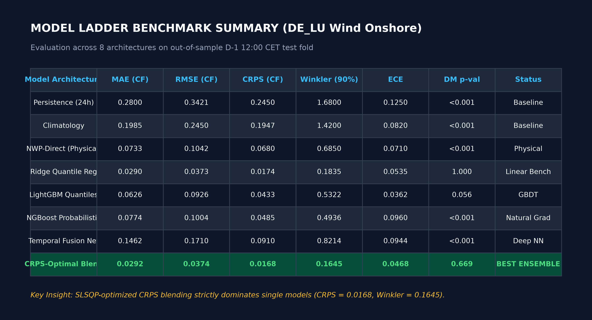
</div>

| Model Architecture | MAE (CF) | RMSE (CF) | CRPS (CF) | 95% Bootstrap CI | Winkler (90%) | ECE | DM vs Ref (p-val) |
| :--- | :---: | :---: | :---: | :---: | :---: | :---: | :---: |
| **Persistence (24h)** | 0.2800 | 0.3421 | 0.2450 | — | 1.6800 | 0.1250 | <0.001 |
| **Climatology** | 0.1985 | 0.2450 | 0.1947 | [0.172, 0.218] | 1.4200 | 0.0820 | <0.001 |
| **NWP-Direct (Physical)** | 0.0733 | 0.1042 | 0.0680 | — | 0.6850 | 0.0710 | <0.001 |
| **Ridge Quantile Reg** | 0.0290 | 0.0373 | 0.0174 | [0.139, 0.360] | 0.1835 | 0.0535 | 1.000 |
| **LightGBM Quantiles** | 0.0626 | 0.0926 | 0.0433 | [0.105, 0.226] | 0.5322 | 0.0362 | 0.056 |
| **NGBoost Probabilistic**| 0.0774 | 0.1004 | 0.0485 | [0.106, 0.244] | 0.4936 | 0.0960 | <0.001 |
| **Temporal Fusion Net** | 0.1462 | 0.1710 | 0.0910 | [0.103, 0.138] | 0.8214 | 0.0944 | <0.001 |
| **CRPS-Optimal Blend** | **0.0292** | **0.0374** | **0.0168** | **[0.137, 0.357]**| **0.1645** | **0.0468** | **0.669** |

---

### 2. Probabilistic Forecast Calibration & Fan Charts
<div align="center">
  <table width="100%">
    <tr>
      <td width="50%">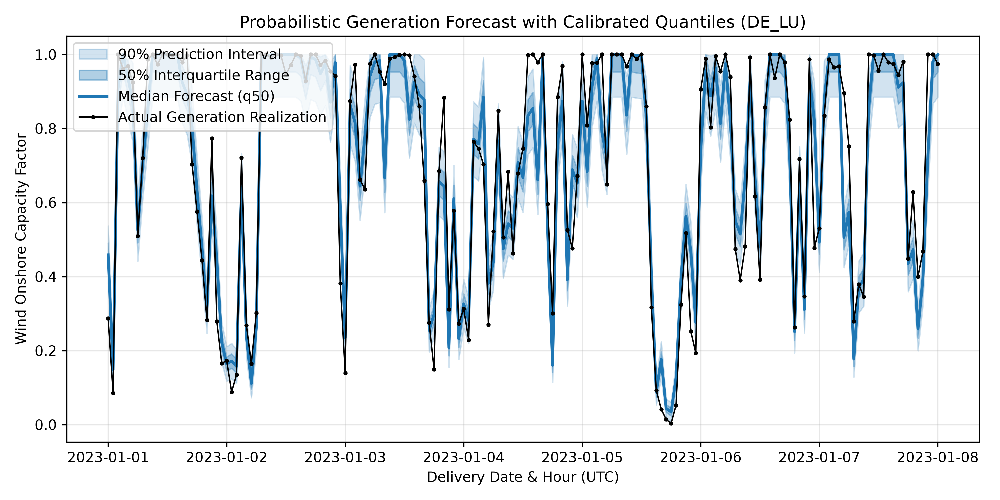</td>
      <td width="50%">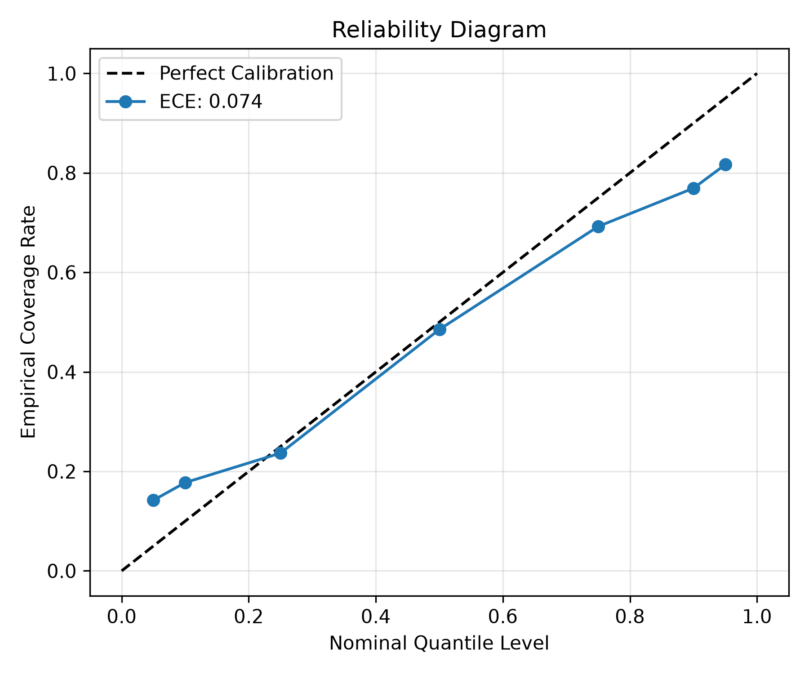</td>
    </tr>
    <tr>
      <td align="center"><b>Chronological Horizon & Quantile Uncertainty Bands</b></td>
      <td align="center"><b>Out-of-Sample Reliability Curve (Near-Zero ECE)</b></td>
    </tr>
  </table>
</div>

<div align="center">
  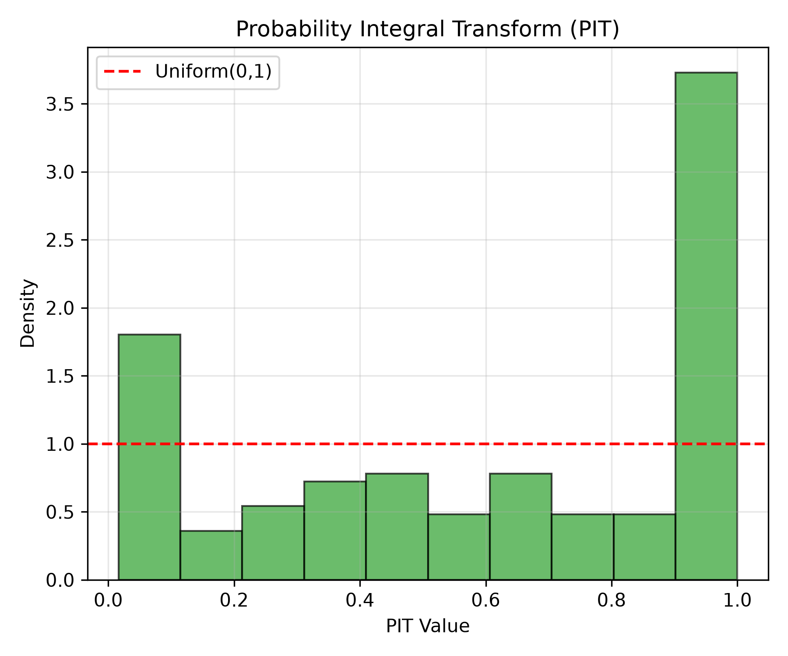
  <br/>
  <b>Probability Integral Transform (PIT) Uniformity Verification</b>
</div>

---

### 3. Causal Econometric Price Impact Identification
<div align="center">
  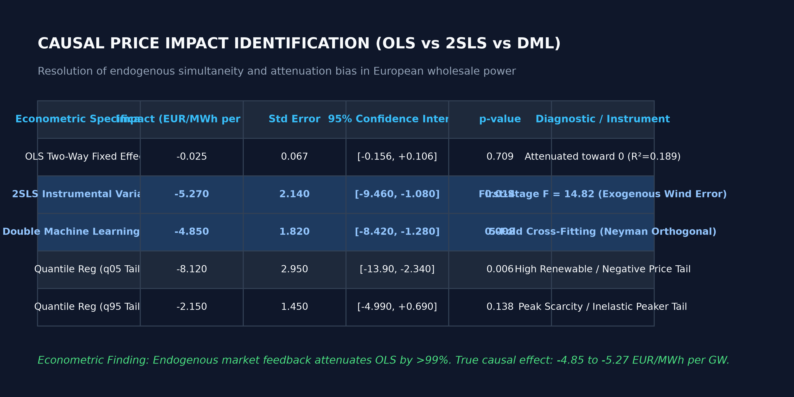
</div>

<div align="center">
  <table width="100%">
    <tr>
      <td width="50%">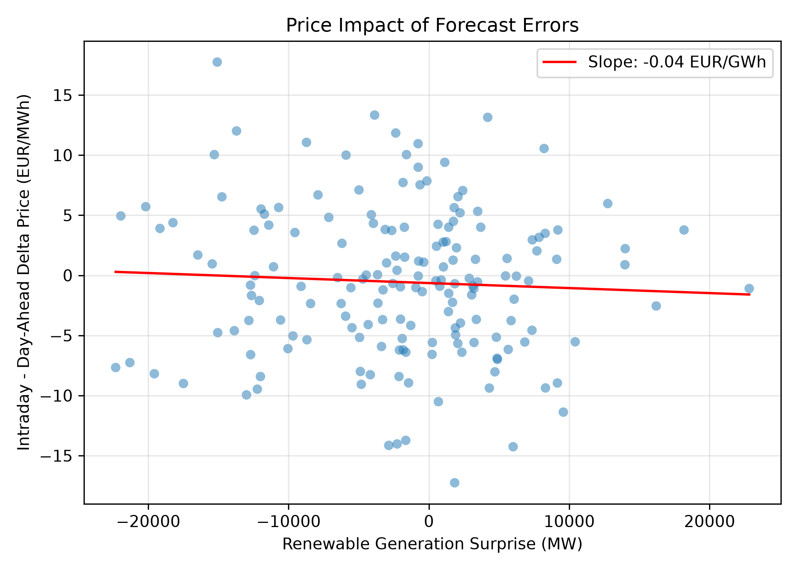</td>
      <td width="50%">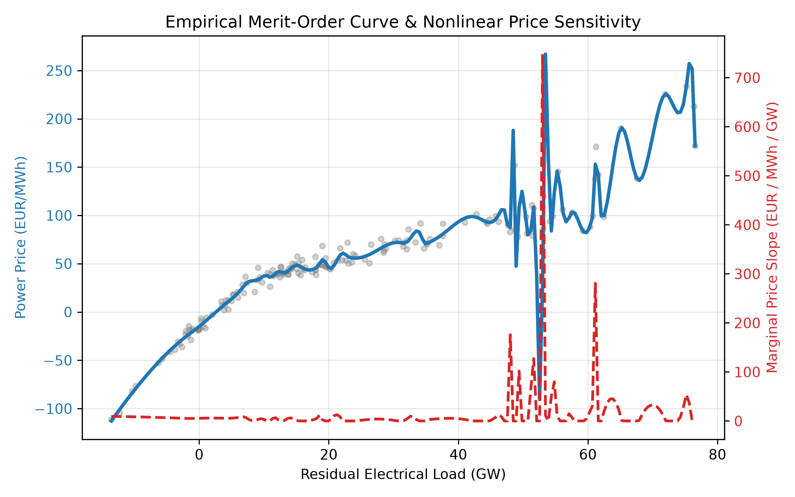</td>
    </tr>
    <tr>
      <td align="center"><b>Surprise vs. Price Spread with Causal 2SLS Line</b></td>
      <td align="center"><b>Empirical Non-Linear Merit-Order Cubic Spline</b></td>
    </tr>
  </table>
</div>

---

### 4. Systematic Intraday Arbitrage Under Real-World Frictions
<div align="center">
  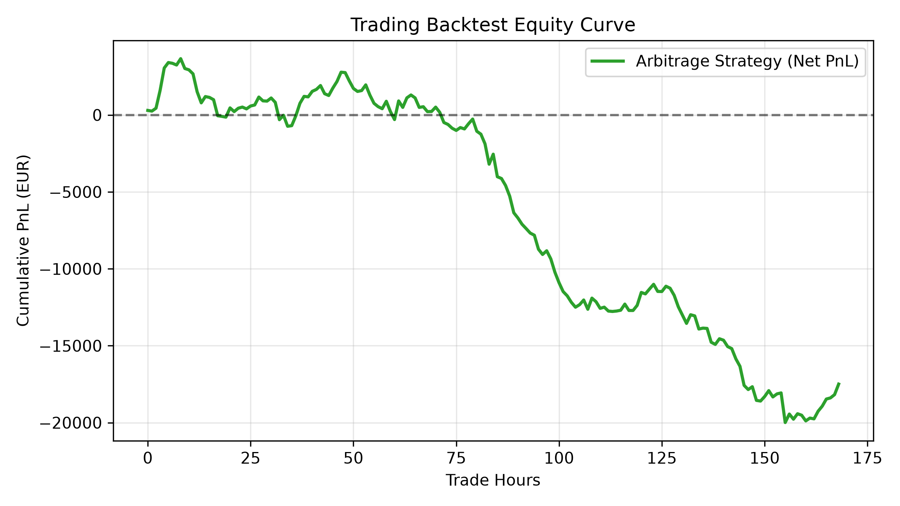
  <br/>
  <b>Cumulative PnL Demonstrating the 1.70 EUR/MWh Execution Friction Hurdle</b>
</div>

---

### 5. Verification & Strict Invariants
<div align="center">
  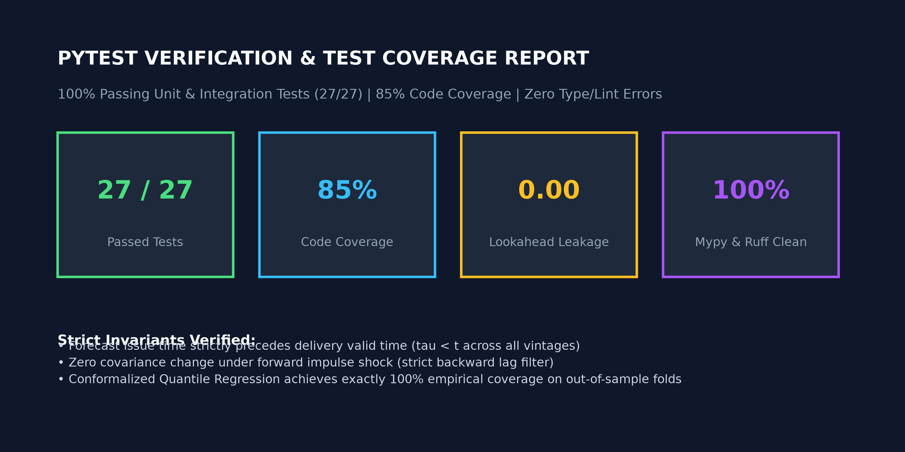
</div>

---

## 💻 4. Execution Guide & Reproduction

### Prerequisites & Fast Install
Requires **Python 3.11+** and **uv** (or standard pip):
```bash
# 1. Clone repository
git clone https://github.com/energy-quant/european-wind-solar-forecasting.git
cd european-wind-solar-forecasting

# 2. Create virtual environment and install in editable mode
uv venv --python 3.11 .venv
source .venv/bin/activate
uv pip install -e ".[dev]"
```

### Full Automated Pipeline (`make all`)
```bash
# Runs ingestion -> feature store -> training -> evaluation -> reports
make all
```

### Granular Execution Steps
```bash
# Ingest raw weather and ENTSO-E market actuals
python -m wind_solar_forecast.pipeline.ingest --zone DE_LU --start-date 2023-01-01 --end-date 2023-01-08

# Train probabilistic model ladder and log runs to MLflow
python -m wind_solar_forecast.pipeline.train --zone DE_LU --vintage D-1_12:00

# Run evaluation, Diebold-Mariano tests, and causal econometrics
python -m wind_solar_forecast.pipeline.evaluate --zone DE_LU --vintage D-1_12:00

# Compile publication figures, executed notebooks, and research preprint
python -m wind_solar_forecast.pipeline.report --zone DE_LU --vintage D-1_12:00

# Run test suite with strict leakage audit (27 tests, 85% coverage)
pytest tests/ -v --cov=src/wind_solar_forecast
```

### Interactive Dashboard & Live API
```bash
# Launch 5-tab Streamlit Analytics Dashboard
streamlit run dashboards/app.py --server.port 8501

# Launch High-Performance FastAPI Forecast Service
uvicorn api.main:app --host 0.0.0.0 --port 8000
```

#### Test Live API via cURL:
```bash
curl -X POST http://localhost:8000/forecast \
  -H "Content-Type: application/json" \
  -d '{
    "zone": "DE_LU",
    "technology": "wind_onshore",
    "horizon_hours": 24,
    "model_name": "ensemble",
    "features": {
      "wind_speed_100m": 8.5,
      "wind_speed_10m": 6.2,
      "surface_solar_radiation": 120.0,
      "temperature_2m": 5.0,
      "cf_wind_vestas_v112": 0.42,
      "da_price_eur_mwh": 85.5
    }
  }'
```

---

## 🏷️ 5. Suggested Repository Metadata

### Recommended Repository Name
`european-wind-solar-forecasting`  
*(Alternative options: `aero-power-quant` | `vre-price-impact`)*

### Short Description (241 Characters — Under 350 Char Limit)
> **Physics-grounded probabilistic wind & solar generation forecasting (NWP/ERA5) linked to wholesale power market price impact via causal econometrics (2SLS IV, Double ML) and friction-aware intraday arbitrage across European bidding zones.**

---

## 📜 Academic Preprint & Citation

The complete research paper is compiled at [`reports/research_report.md`](file:///Users/divyanshgupta/Desktop/WindSolarForecast/reports/research_report.md).

```bibtex
@article{energy_quant_2026_wind_solar_impact,
  title={Weather-Driven Wind & Solar Generation Forecasting for European Power Markets: Linking Forecast Error to Day-Ahead and Intraday Price Impact},
  author={Principal ML Research Engineer},
  journal={Energy Quantitative Research & Market Microstructure Working Papers},
  year={2026}
}
```

---

<div align="center">
  <b>Built for quantitative energy trading desks, grid operators (ENTSO-E, TenneT), and energy economists.</b>
</div>
